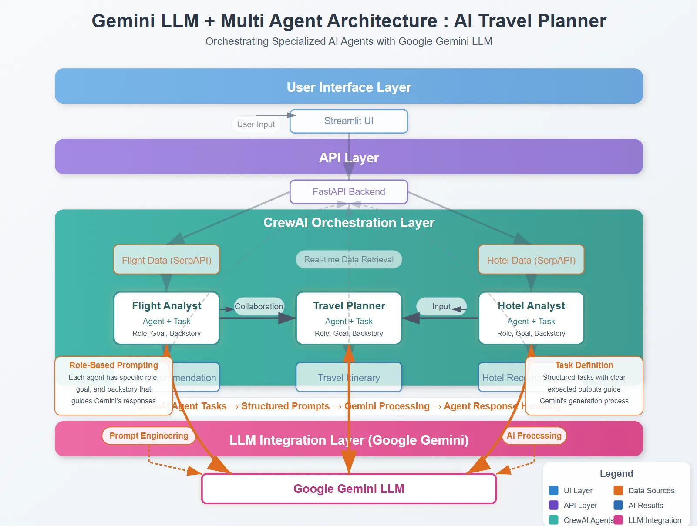
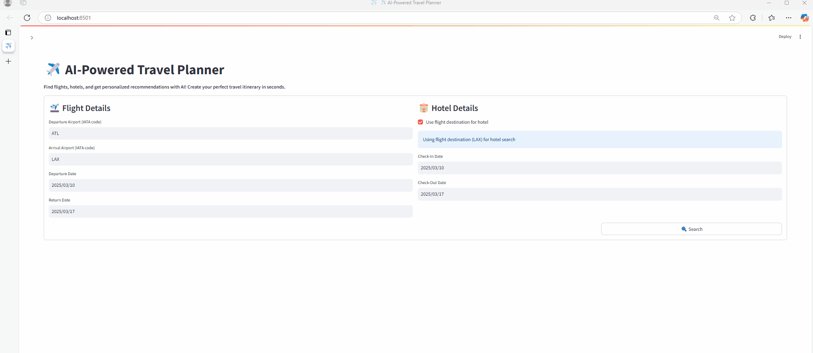

# Multi-Agent AI Travel Planner

An agentic AI travel planning application using Gemini LLM and CrewAI framework. This project demonstrates how AI agents collaborate to streamline the travel planning process - retrieving real-time flight and hotel data, analyzing options, and generating personalized itineraries.



## Demo



## Overview

This project demonstrates how to build a multi-agent system where specialized AI agents work together to create comprehensive travel plans. Instead of manually searching across multiple platforms, this application automates the process through intelligent AI collaboration.

The system leverages:
- **Gemini 2.0 LLM**: Powers the intelligence behind each agent
- **CrewAI**: Coordinates the multi-agent workflow
- **SerpAPI**: Retrieves real-time flight and hotel data
- **FastAPI**: Handles backend API endpoints
- **Angular**: Provides a user-friendly interface

## Key Features

### 1. Flight Search Automation
- Retrieves real-time flight data from Google Flights via SerpAPI
- Filters flights based on price, layovers, and travel time
- AI recommends the best flight based on cost-effectiveness and convenience

### 2. Hotel Recommendations
- Searches real-time hotel availability from Google Hotels
- Filters based on location, budget, amenities, and user ratings
- AI suggests the best hotel by analyzing factors like proximity to key locations

### 3. AI-Powered Analysis & Recommendations
- Gemini LLM-powered AI agent evaluates travel options
- Uses CrewAI to coordinate multiple AI agents for better decision-making
- AI explains its recommendation logic for flights and hotels

### 4. Dynamic Itinerary Generation
- AI builds a structured travel plan based on flight and hotel bookings
- Generates a day-by-day itinerary with must-visit attractions, restaurant recommendations, and local transportation options

### 5. User-Friendly Interface
- Angular provides an intuitive UI for inputting travel preferences
- Interactive tabs for viewing flights, hotels, and AI recommendations
- Downloadable formatted itinerary

## Based On
This project is based on the article: [Agentic AI: Building a Multi-Agent AI Travel Planner using Gemini LLM & Crew AI](https://medium.com/google-cloud/agentic-ai-building-a-multi-agent-ai-travel-planner-using-gemini-llm-crew-ai-6d2e93f72008)

Changes were made to use Angular frontend instead of Streamlit.

## Installation

### Prerequisites
- Python 3.8+
- Node.js (v18 or higher)
- npm (v9 or higher)
- SerpAPI key for fetching real-time flight and hotel data
- Google Gemini API key for AI recommendations

### Setup

1. Clone the repository
   ```bash
   git clone https://github.com/Abhilash001/gemini-crewai-travelplanner.git
   cd gemini-crewai-travelplanner
   ```

2. Create and activate a virtual environment
   ```bash
   # Create virtual environment
   python -m venv venv

   # Activate virtual environment
   # On Windows
   venv\Scripts\activate
   # On macOS/Linux
   source venv/bin/activate
   ```

3. Install dependencies
   ```bash
   pip install -r requirements.txt
   ```

4. Configure API keys
   
   Set your API keys in the .env file:
   ```env
   GEMINI_API_KEY=your_gemini_api_key_here
   SERP_API_KEY=your_serpapi_key_here
   ```

- Get a Gemini API key from [Google AI Studio](https://makersuite.google.com/)
- Get a SerpAPI key from [SerpAPI](https://serpapi.com/)

5. **Install Angular CLI globally:**
   ```bash
   npm install -g @angular/cli@19
   ```

6. **Navigate to UI folder and install project dependencies:**
   ```bash
   npm install
   ```

## Usage

1. Start the FastAPI backend
   ```bash
   python backend.py
   ```

2. In a new terminal window, navigate to UI folder and start the Angular development server:
   ```bash
   ng serve
   ```

3. Open your browser and navigate to http://localhost:4200

4. Enter your travel preferences:
   - Input departure and destination airports
   - Set travel dates
   - Select search mode (complete, flights only, or hotels only)
   - Click "Search" and wait for the AI to process your request

5. Review the personalized results:
   - Flight options with AI recommendations
   - Hotel options with AI recommendations
   - Day-by-day itinerary with activities and restaurant suggestions

## Architecture

### Multi-Agent System
The application uses a collaborative AI system with specialized agents:

1. **Flight Analyst Agent**:
   - Analyzes flight options based on price, duration, stops, and convenience
   - Provides structured recommendations with reasoning

2. **Hotel Analyst Agent**:
   - Evaluates hotel options based on price, rating, location, and amenities
   - Offers detailed hotel recommendations with pros and cons

3. **Travel Planner Agent**:
   - Creates comprehensive itineraries using flight and hotel information
   - Schedules activities, meals, and transportation for each day of the trip

### Project Structure

- `backend.py`: Uvicorn backend application
- `common.py`: Common file with variables and methods for utils, data fetching, and AI agents
- `api_endpoints.py`: FastAPI backend application with API endpoints
- `requirements.txt`: Project dependencies
- `images/`: Directory containing demonstration images and GIFs
  - `travelplanner.webp`: Static screenshot of the application interface
  - `travelplanner-demo.gif`: Animated demonstration of the application in use
- `UI`: Angular UI. Check Readme in that folder for more details.

## Implementation Details

The application follows a modular architecture:

1. **API Initialization**:
   - FastAPI setup with endpoints for flight search, hotel search, and itinerary generation
  
2. **Data Retrieval**:
   - Asynchronous functions connect to SerpAPI to fetch real-time flight and hotel data
   - Response formatting and data validation using Pydantic models

3. **AI Analysis**:
   - CrewAI orchestrates specialized AI agents
   - Each agent analyzes specific aspects of the travel plan
   - Gemini LLM powers the intelligence of each agent

4. **Frontend Interface**:
   - Angular UI with interactive forms and tabs
   - Real-time data display with filtering options
   - Downloadable itinerary generation

## Author

For more articles on AI/ML and Generative AI, follow the original author on Medium:
[https://medium.com/@arjun-prabhulal](https://medium.com/@arjun-prabhulal)

